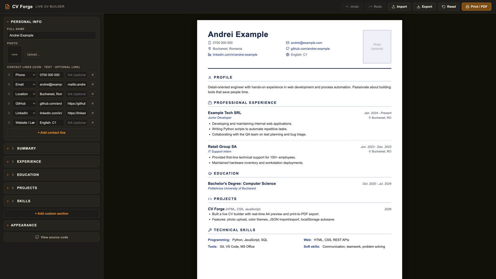
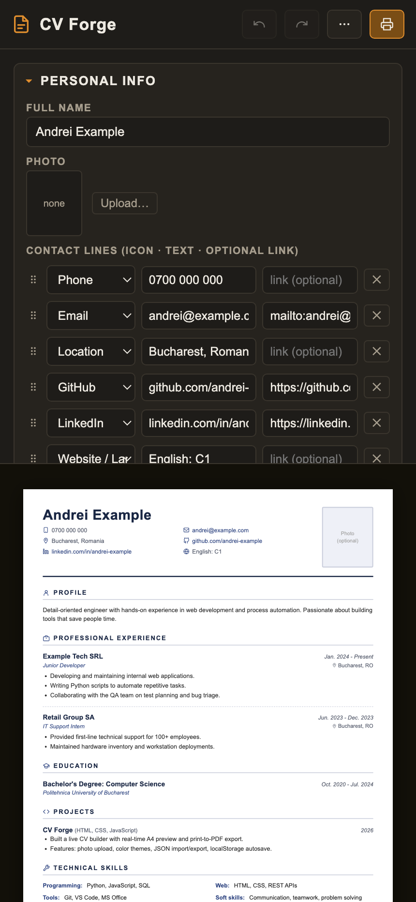

# CV Forge

**A CV builder that lives entirely in your browser.** Type on the left, watch a print-perfect A4 page take shape on the right, hit Print - done.

No frameworks. No build step. No server. No account. No tracking. Just open `index.html`.

**Live demo: [cvforge.andyeas.com](https://cvforge.andyeas.com/)**

It works on a phone too: the editor stacks above the preview and the toolbar collapses its secondary actions into a "..." menu.

## Why

I built this because I wanted a simple, clean and easy to read CV for myself, and I could not find a tool that just did that.

Most online CV builders want an account, an email, a subscription - and your personal data on their servers. CV Forge is the opposite: a single static page where **everything stays on your machine**. Your data never leaves the browser.

## Features

### Editing
- **Live A4 preview** - every keystroke updates a true-to-print page instantly
- **Click-to-edit** - click anything on the preview (name, a job, a heading, a contact line...) and the editor jumps to and focuses that exact field
- **Drag & drop** - reorder whole sections and contact lines with the drag handles
- **Undo / Redo** - toolbar buttons plus `Ctrl+Z` / `Ctrl+Y` for every change: edits, deletes, reorders, imports, even resets
- **Custom sections** - Certifications, Volunteering, Languages... each with titled, dated, bulleted entries
- **Renameable titles** - write your CV in any language

### Appearance
- **10 color themes** - navy, burgundy, forest, teal, charcoal, black, slate, ocean, plum, rust
- **Custom color** - pick any color and a full matching palette is derived automatically
- **Photo** - optional; resized and embedded client-side, never uploaded
- **Icon toggle** - switch off all icons for a plainer, traditional look
- **Font scaling** - shrink or grow the whole document to fit exactly one page
- **Page guides** - dashed markers show exactly where each printed A4 page ends

### Data
- **Autosave** - persists in `localStorage`, survives closing the tab
- **JSON export / import** - back up your CV or move it between devices
- **Print / Save as PDF** - clean `@media print` output: just the document, no app chrome

## Usage

1. Open `index.html` in any modern browser (or host the folder anywhere static).
2. Replace the example data in the left panel - the preview updates live.
3. Click **Print / PDF** -> *Save as PDF*.
4. Optionally **Export** your data as JSON for backup.

> **Tip:** exported files are named `cvforge_<your_name>.json` and contain your personal data - keep them out of public repos. This repo's `.gitignore` already excludes them.

## Hosting

It's a static page - host it anywhere:

- **GitHub Pages:** Settings -> Pages -> deploy from the `main` branch
- **Any web server:** copy `index.html`, `style.css`, `app.js` and you're done

## Tech notes

- Vanilla **HTML / CSS / JavaScript** - zero dependencies
- A single state object drives both the editor form and the CV preview
- Debounced `localStorage` autosave; snapshot-based undo history (100 steps)
- `FileReader` + `<canvas>` for client-side photo resizing
- All user input is HTML-escaped; links and imported JSON are sanitized
- `@page` CSS + `break-inside` rules for clean multi-page PDF output

## Manual testing

I tested the app by hand while building it:

- **Functional testing** - went through every feature and checked it does what it should: editing fields, adding and deleting entries, reordering, changing themes, photo upload, export/import, undo/redo, print
- **Edge cases** - tried very long names, a CV with several pages of content, empty sections, and the minimum/maximum font size
- **Negative testing** - tried to break it on purpose: importing a broken or wrong JSON file, pasting HTML into text fields, links typed without `https://`
- **UI checks** - resized the window, hovered everything, checked that buttons look right in every state (disabled, hover, active)
- **Print testing** - printed to PDF and compared it against the preview, checked that nothing gets cut in half between pages
- **Retesting after changes** - after adding something new, re-checked the older features to make sure nothing broke
- **DevTools check** - went through the Issues tab in Chrome DevTools and fixed the warnings (missing ids and labels on form fields)

## Privacy

Everything runs 100% locally in your browser. Nothing is uploaded, logged, or tracked - there is no backend to upload to.

## License

[MIT](LICENSE)
